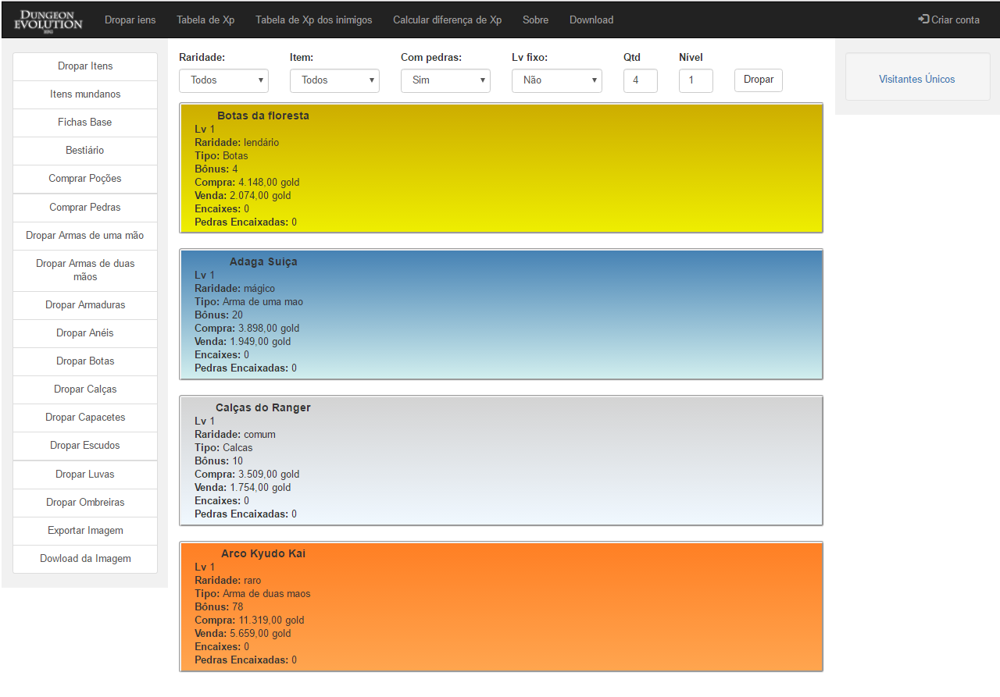
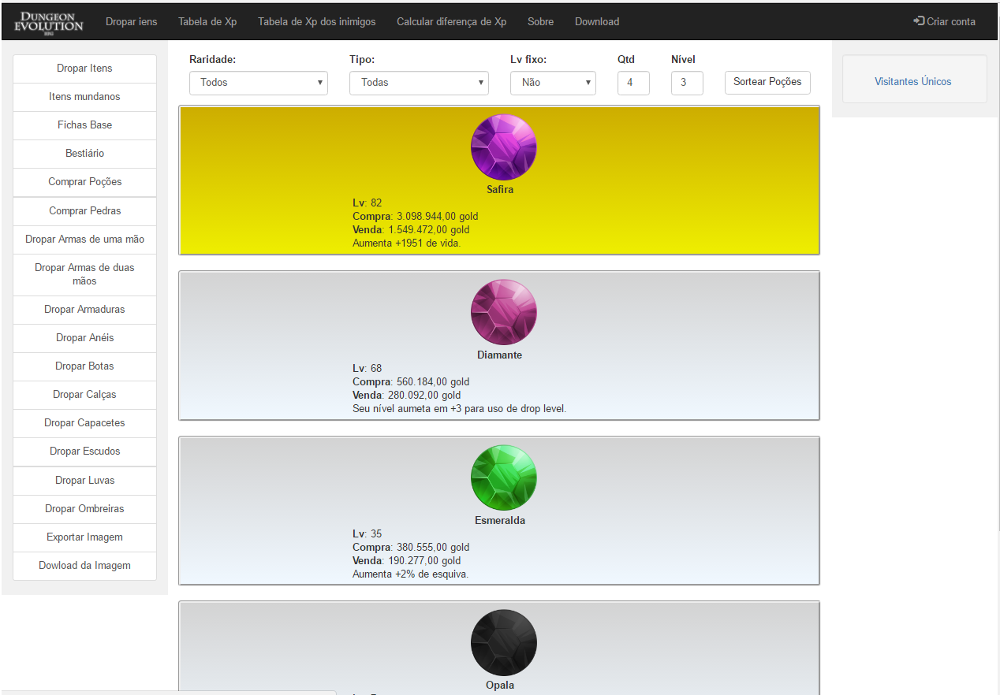
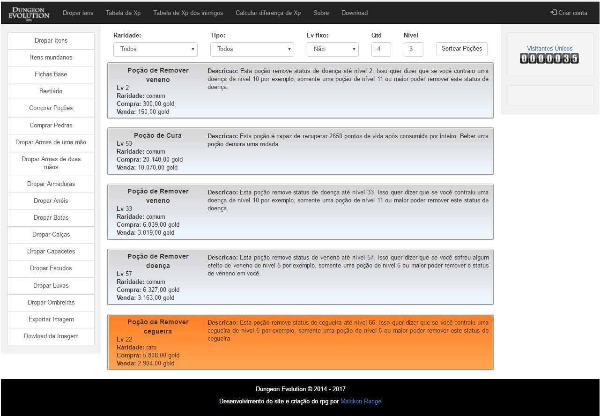
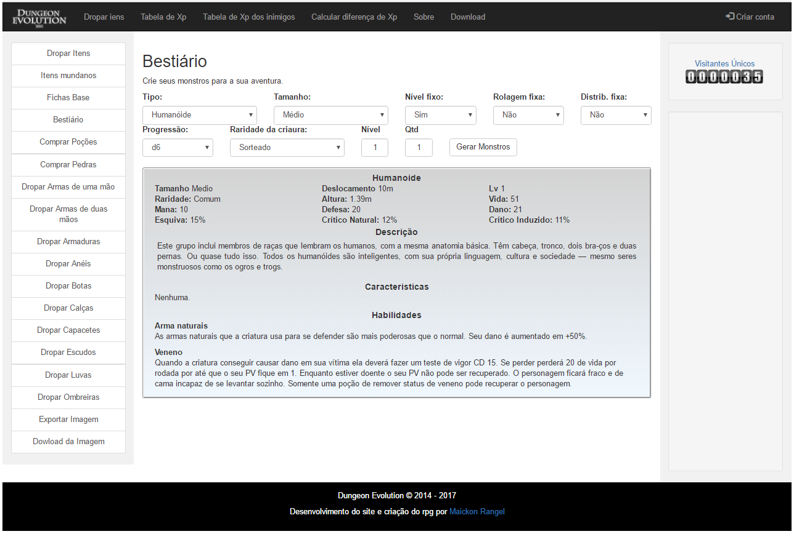
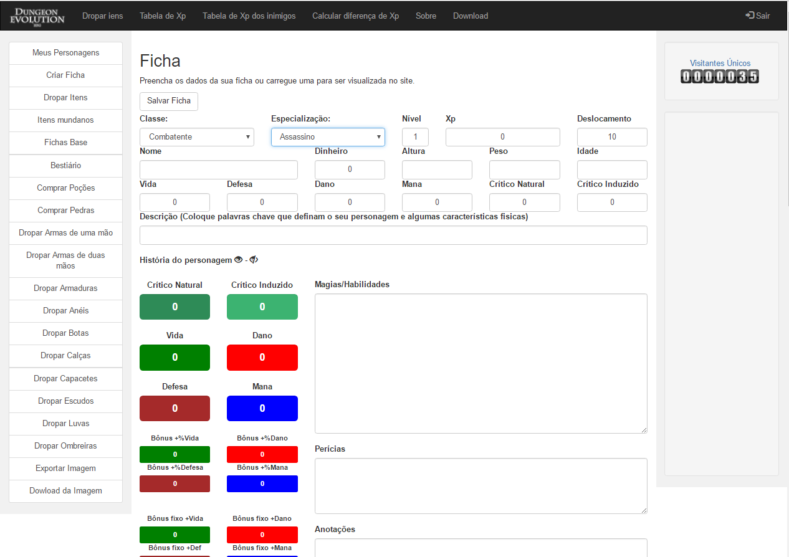
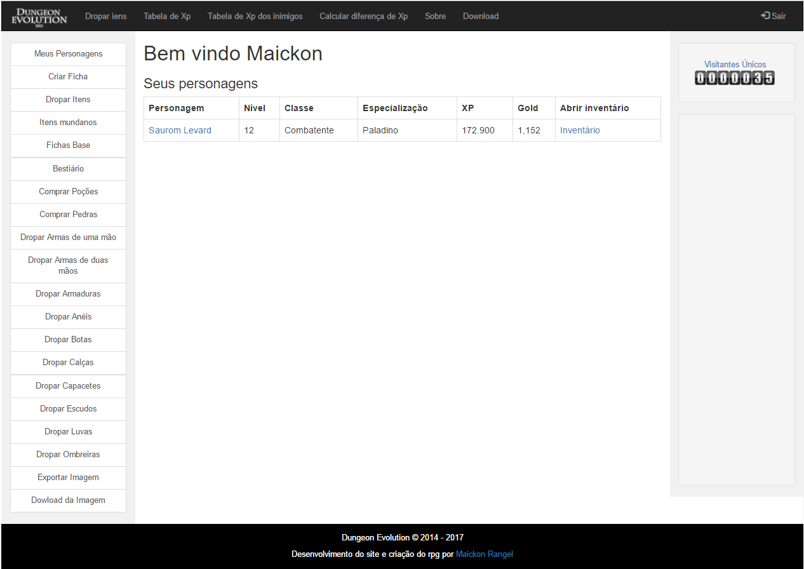
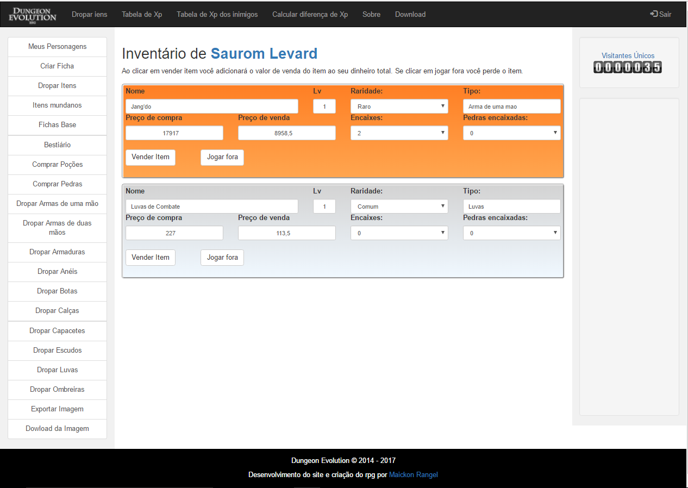

O Dungeon Evolution é um sistema de RPG que funciona em conjunto com um site que oferece diversas ferramentas para o uso dos jogadores. Diferente dos demais RPGs de mesa encontrados por aí, no Dungeon Evolution os jogadores recebem os seus equipamentos através de um sistema de sorteio que o próprio site oferece. 

Isso significa que o mestre não tem como saber o tipo de item que seus jogadores receberão ao longo de suas aventuras. Tudo é feito de forma surpresa através dos geradores.

A versão 4.0 foi totalmente reprogramada e por causa disso preferi colocá-la em um novo repositório. O repositório antigo ainda existe e mantêm o seu mesmo endereço antigo. Só preferi mantê-lo para que as pessoas pudessem visualizar as melhorias que o site veio tendo ao longo do tempo.

Melhorias
=========

# Página de dropar itens

Com relação a versão anterior foram adicionados novas opções de filtro na págia de dropar itens. Antes o jogador só podia escolher a quantidade de itens, o tipo e o seu nível. Nesta versão o jogador tem a opção de escolher a raridade do item, se ele pode vir com pedras anexadas ou não, opção de exportar os itens sorteados como imagem ou salvá-lo no seu inventário caso o jogador tenha uma conta no site e esteja logado nela com um personagem escolhido. 

Tela da página de dropar itens.

# Página de dropar pedras
Foi adicionado uma página exclusivamente para o sorteio de pedras de forma separada. Nesta página os jogadores podem simular o encontro aleatório ou uma compra num bazar. As pedras também podem ser adicionadas ao inventário caso o jogador esteja logado.

# Página de dropar poções
Foi adicionado uma página exclusivamente para o sorteio de poções de forma separada. Nesta página os jogadores podem simular o encontro aleatório ou uma compra num bazar. As poções também podem ser adicionadas ao inventário caso o jogador esteja logado.

# Bestiário
Esta página gera fichas prontas de criaturas para o uso nas aventuras. Ao invés do mestre ter de criar do 0 uma ficha, nesta página ele poderá gerar uma de forma automática. A página oferece opções para a criação do monstro como raça, nível, tamanho e etc.

Além da opção de bestiário existe uma página voltada para a criação de personagens mais simples como pessoas comuns em cidades durante uma aventura.

# Painel
Como informado antes, o jogador poderá criar uma conta no site para poder guardar as suas fichas de personagens criadas para jogar Dungeon Evolution. As fichas serão listadas dentro da página de personagens.

Quando criado a conta o jogador deverá criar uma ficha clicando no item de menu do lado esquerdo chamado "Criar Ficha". Ao clicar no botão o jogador será levado para a página de criação de personagem. 

Quando a ficha for preenchida e salva ela será listada na página dos seus personagens.

# Ficha
Dentro da página de personagens o jogador poderá clicar sobre o nome do personagem para abrir a sua ficha e editá-la ou clicar no link que o levará até a página de inventário. 

# Inventário
Na página de inventário o jogador encontrará todos os itens que ele decidiu adicionar ao seu inventário. Nesta página o jogador pode jogar o item fora (excluí-lo) ou vendê-lo. Basta clicar no botão adequado. 

